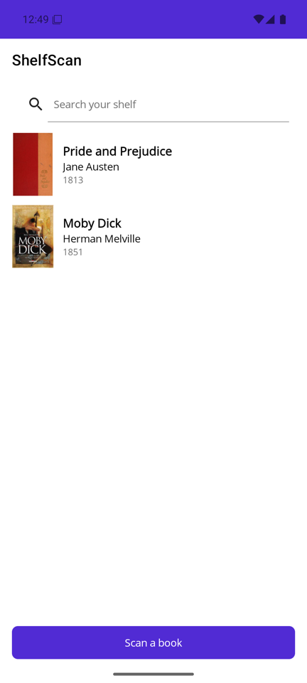
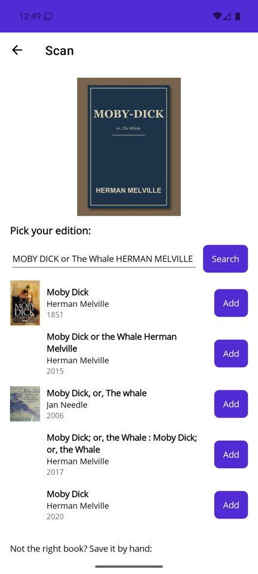
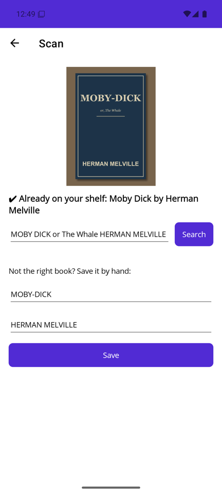
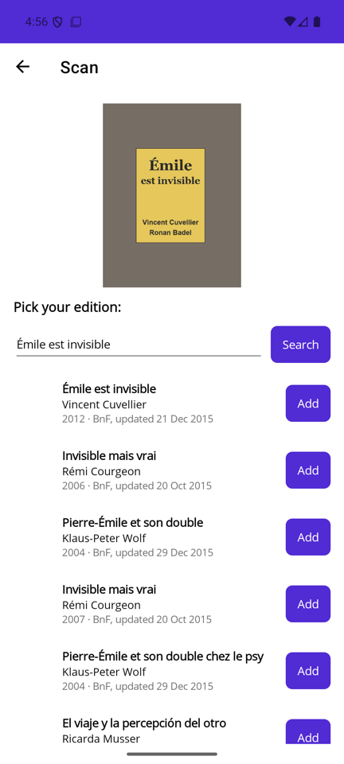

# ShelfScan

[](https://github.com/Romain-OD/ShelfScan/actions/workflows/ios.yml)

A .NET MAUI app for the books you own. Photograph a cover and the phone reads the title and
author on the device (ML Kit on Android, Apple Vision on iOS). It tells you if the book is already
on your shelf. If not, it looks the book up on [Open Library](https://openlibrary.org) and in the
catalogue of the [Bibliothèque nationale de France](https://catalogue.bnf.fr) (BnF) so you can
add it. It targets Android and iOS, trimmed and compiled ahead of time.

<p>
  
  
  
</p>

The Release APK on the Android emulator
([step 09](docs/build-log.md#step-09--the-release-apk-on-an-emulator-step-09-emulator-e2e)).
iOS builds in CI but has never run: see [Limits](#limits).

## How it works

1. **Scan a book** opens the camera.
2. The phone reads the cover: ML Kit Text Recognition on Android, with the model bundled in the
   APK so it works offline, and `VNRecognizeTextRequest` from Apple's Vision framework on iOS.
3. The big text becomes the search query: every line at least 40% as tall as the tallest one,
   in reading order, without punctuation. You can edit it.
4. The shelf is checked first, offline. If every word of a book's title and one word of its
   author appear on the cover, the page says *Already on your shelf* and sends no request.
5. Otherwise it searches Open Library and the BnF at the same time, up to 5 books each, and lists
   first the books that share the most words with the query. One you already own shows a disabled
   **Owned** (on Open Library, any edition counts), and **Add** saves the others. For a book
   neither catalogue has, the form below the results saves it by hand, prefilled with the two
   biggest lines.

The shelf page lists your books, with a search box that filters as you type. The shelf is one
JSON file, written with System.Text.Json source generation (no reflection). Each add writes a
temporary file, then renames it over the old one.

| Project | What's in it |
|---|---|
| `ShelfScan.Core` | `net10.0`: books, shelf, matching, OCR query, Open Library and BnF clients |
| `ShelfScan.Core.Tests` | MSTest, 14 tests, no mocking library |
| `ShelfScan.App` | MAUI, `net10.0-android;net10.0-ios`: two pages, camera, OCR |

## Build and run

You need the .NET SDK 10.0.302 or a later 10.0.3xx patch. `global.json` pins that band and the
workload set (10.0.303.1).

```powershell
dotnet workload restore ShelfScan.App/ShelfScan.App.csproj
dotnet test ShelfScan.Core.Tests
dotnet publish ShelfScan.App -f net10.0-android -c Release
adb install -r ShelfScan.App/bin/Release/net10.0-android/publish/dev.romain.shelfscan-Signed.apk
```

Android also needs the Android SDK (API 36) and a JDK. This repo was built with Microsoft
OpenJDK 21. Trimming and AOT only happen in Release, so test a Release build, not a Debug run.

iOS needs a Mac with Xcode 26.6. There's no Mac here, so [GitHub Actions](.github/workflows/ios.yml)
runs the tests and publishes an unsigned `ios-arm64` app on every push to `main` and every pull
request. The workflow shows the publish command, and keeps the Native AOT `.ipa` for
[installing on an iPhone](#iphone).

To measure Android size and startup yourself, start an emulator and run the script. It
publishes four variants, then times 20 cold starts of each:

```powershell
.\scripts\measure-android.ps1 -Adb "$env:LOCALAPPDATA\Android\Sdk\platform-tools\adb.exe"
```

## Install on your phone

### Android

The Release publish above writes `dev.romain.shelfscan-Signed.apk`, for Android 6.0 or later on
a 64-bit ARM phone (or an x86_64 emulator). Install it one of two ways:

- **USB.** Turn on USB debugging in the phone's Developer options, plug it in, accept the
  prompt, then run the `adb install -r` line above.
- **No cable.** Copy the APK to the phone and open it. Android first asks you to let the app
  that opens it (a file manager, a browser) install unknown apps.

The APK is signed with the debug key of the machine that built it. An APK built on another
machine can't update it: uninstall first, which deletes your shelf. Google Play needs your own
key ([Microsoft's guide](https://learn.microsoft.com/dotnet/maui/android/deployment/publish-cli)).

### iPhone

An iPhone only runs apps signed through an Apple account, and this repo has no signing secrets.
So the [ios workflow](.github/workflows/ios.yml) keeps the unsigned Native AOT build: open a
green run while signed in to GitHub, and download `ShelfScan.App.ipa` under **Artifacts**. Then
sign and install it one of three ways:

- **A free Apple ID, no Mac.** [Sideloadly](https://sideloadly.io) signs the `.ipa` with your
  Apple ID and installs it over USB. On Windows it needs the web versions of iTunes and iCloud,
  not the Microsoft Store ones. It's a third-party tool that asks for your Apple ID password, so
  a secondary Apple ID is safer. With a free account the app runs for 7 days, then has to be
  signed again (Sideloadly can do it for you). On the phone, turn on **Settings > Privacy &
  Security > Developer Mode** (iOS 16 and later), then trust your Apple ID under
  **Settings > General > VPN & Device Management**.
- **A Mac with Xcode 26.6.** Provision the phone, then run the app on it from the command line
  ([Microsoft's guide](https://learn.microsoft.com/dotnet/maui/ios/cli#launch-the-app-on-a-device)).
- **A paid Apple Developer Program membership.** CI could sign the app and upload it to
  TestFlight, with the certificate, provisioning profile and App Store Connect key as repository
  secrets. That isn't set up.

Whichever you pick, it's the app's first run on iOS (see [Limits](#limits)).

## Trimming and AOT, measured

| | Android | iOS |
|---|---|---|
| Compiler | Mono AOT with a startup profile (the Release default) | Native AOT (`PublishAot`) |
| Trimming | `TrimMode=full`: our code and every package | full (Native AOT implies it) |
| Analyzers | `IsAotCompatible` in App and Core: trim and AOT problems become build warnings | same |

**Android** ([step 10](docs/build-log.md#step-10--size-and-startup-measured-step-10-measure-android)):
the universal APK, and the median time to first frame over 20 cold starts. Two runs, each on a
fresh boot of an x86_64 emulator (Android 16, 4 GB).

| Build | APK | Cold start, two runs |
|---|---|---|
| Defaults: partial trim, profiled AOT | 38.29 MB | 827 / 925 ms |
| Full trim, no AOT (JIT) | 30.06 MB | 1311 / 1422.5 ms |
| **ShelfScan: full trim, profiled AOT** | **35.69 MB** | **888 / 949 ms** |
| Full trim, full AOT | 43.98 MB | 872 / 922 ms |

- AOT is what makes startup fast: without it, the first frame comes about 50% later.
- Full AOT adds 8.29 MB for no measurable startup gain, so ShelfScan keeps the startup profile.
- Full trimming saves 2.60 MB over the defaults, with the trim analysis on. The defaults turn
  it off, so their 0 warnings prove nothing.
- These are step 10's numbers. The BnF search, added later, costs 220 KB, most of it for the XML
  parser, so the APK is now 35.91 MB
  ([details](docs/build-log.md#after-step-12--more-books-the-bnf-catalogue)).

**iOS** ([step 11](docs/build-log.md#step-11--ios-in-github-actions-step-11-ios-ci)):
unsigned `ios-arm64` Release builds in GitHub Actions.

| Build | `.app` | `.ipa` | Publish time, four runs |
|---|---|---|---|
| Defaults: Mono AOT, partial trim | 45.10 MB | 15.47 MB | 8:40 to 9:29 |
| **ShelfScan: Native AOT** | **14.88 MB** | **5.98 MB** | **1:57 to 3:29** |

The `.app` is 3× smaller and the `.ipa` 2.6× smaller. The publish was 2.6× to 4.4× faster,
depending on the run. These are step 11's numbers. The BnF search, added later, makes the Native
AOT `.app` 15.81 MB and the `.ipa` 6.33 MB (+358 KB)
([details](docs/build-log.md#after-step-12--more-books-the-bnf-catalogue)).

**Warnings.** ShelfScan's own code has none, on either platform. The iOS publish shows 2, from
MAUI 10.0.20's HybridWebView, which ShelfScan doesn't use. MAUI fixes them in .NET 11. Until then
they stay visible here instead of being silenced
([step 11](docs/build-log.md#step-11--ios-in-github-actions-step-11-ios-ci)).

## Limits

- **iOS has never run.** It compiles and publishes in CI, but there's no Mac or iPhone here, so
  Vision OCR, the camera prompt and startup on iOS are untested.
- The Android numbers come from an emulator, not a phone.
- The query is a guess based on text size. Stylised covers can fool it: edit the query, or save
  the book by hand.
- BnF results have no cover, and the BnF holds mostly books published in France.
- A BnF result is one edition: owning it doesn't mark the book's other editions **Owned**. The
  offline check still recognises the cover, since it compares words.
- On a real Android phone, a sideways photo might be rotated twice (by MediaPicker, then by
  ML Kit). The emulator's photos arrive upright, so that path isn't tested.
- Each add rewrites the whole shelf file. The code notes to move to SQLite past about 10,000
  books. There's no edit or delete yet.

## Book data

Two free catalogues, searched at the same time, neither needing a key:

- [Open Library](https://openlibrary.org/developers/api), with covers.
- The general catalogue of the Bibliothèque nationale de France, through its
  [SRU API](https://api.bnf.fr/fr/api-sru-catalogue-general). Legal deposit puts nearly every book
  published in France in it. Its records are under the
  [Licence Ouverte 2.0](https://www.etalab.gouv.fr/wp-content/uploads/2017/04/ETALAB-Licence-Ouverte-v2.0.pdf),
  which asks to name the source and the date of the last update, so each BnF result shows both.

On 40 French children's books, Open Library found 24 and the BnF all 40
([benchmark](docs/build-log.md#after-step-12--more-books-the-bnf-catalogue)). Amazon's API needs
an Amazon Associates account with recent sales, and Google Books a key: credentials that can't
stay secret in an app.



## How it was built

Twelve steps, each one commit and one tag, from `step-01-scaffold` to `step-12-docs`.
[docs/build-log.md](docs/build-log.md) records what was run, decided and measured at each step,
then the changes made after step 12.

## License

[MIT](LICENSE)
